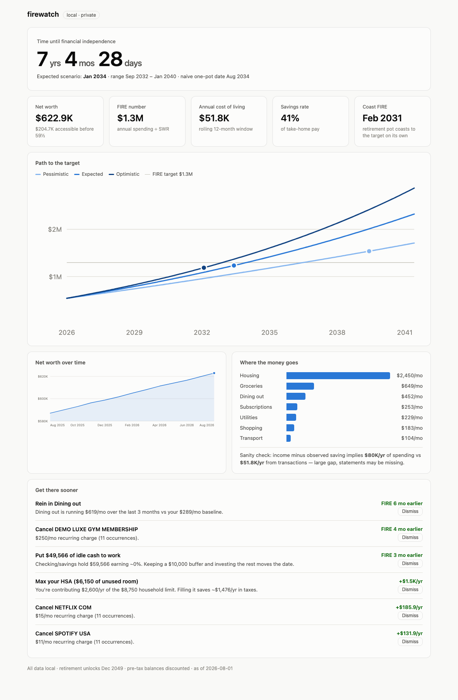

firewatch answers one question: how long until I'm financially independent?
You upload bank statements and pay stubs every few months, and it gives you a
countdown plus concrete suggestions like "cancel that gym membership and
retire 4 months earlier." Everything runs on your own machine: no bank logins,
no aggregators, no analytics, no cloud.

## The interesting problems

Most FIRE calculators multiply your annual spending by 25 and call it a day.
The engineering in firewatch is mostly about refusing to accept answers that
are subtly wrong:

- **The headline date is access-aware.** Retirement accounts are locked until
  59½, so your taxable accounts have to bridge the gap before 401k and HSA
  money is allowed to count. Pre-tax balances get a configurable tax haircut,
  and illiquid holdings are excluded from the runway entirely. The naive 25x
  date is shown alongside, mostly to make the difference visible.
- **Spending can't double-count.** Card payoffs are detected as transfers
  between your own accounts, and overlapping statement uploads deduplicate, so
  batch-uploading messy statements every few months just works.
- **The money math is integer cents**, and dates are pure month arithmetic on
  ISO strings. There is no `Date` object and no floating-point dollar amount
  anywhere in the financial core.
- **The solver simulates month by month**, then finds the earliest feasible
  retirement date by binary search, which works because feasibility is
  monotone.

## Decisions I'd defend

- **The core is a pure engine with no I/O**, heavily tested, with the server
  and dashboard as thin layers on top of it.
- **Local-first is a feature, not a limitation.** The only network calls are
  anonymous price lookups. The planned Apple Watch complication will talk to
  it over Tailscale; there will never be a public API.
- **A public repo about private finances has to defend itself.** The data
  directory lives outside the repo, a pre-commit hook blocks statement-like
  files and card-number-shaped strings, and every test fixture is synthetic,
  enforced by a test.
- **Zero native dependencies.** Node's built-in SQLite means `pnpm install`
  never compiles anything.

## Status

Early days, and built in phases that each end with a working system. Phase 1,
the financial engine and dashboard, is done. Statement ingestion, local-LLM
statement extraction, and recurring-charge analytics are next. The
[source](https://github.com/wLotherington/firewatch) has the full roadmap.
