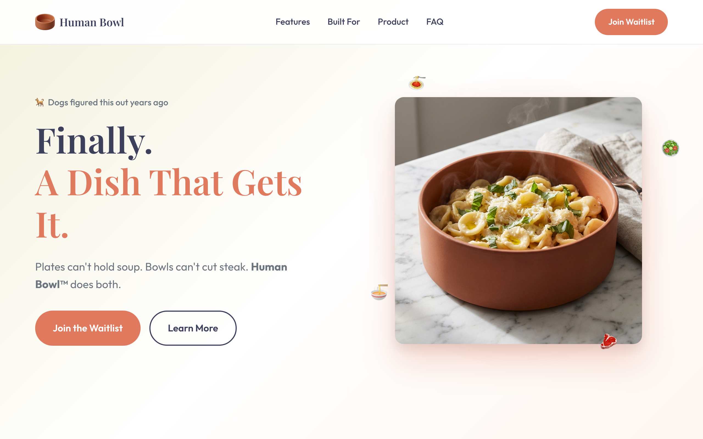

[Human Bowl](https://humanbowl.com/) is a joke product landing page for a
plate/bowl hybrid dish, built on the premise that dogs figured out the ideal
dish shape years ago. It has the full startup-launch treatment: feature
sections, product specs, color options, FAQs, and a waitlist signup.

## Why it's here

The site itself is a toy. What made it worth keeping is how it was made: this
was the first time I got an impressive one-shot LLM response that was better
than anything I would have put together over a weekend. Even all of the images
are LLM generated.

I keep it around as a marker. It's the moment the tooling crossed a line for
me, from "helpful autocomplete" to "ships a complete, polished thing from a
single prompt."
